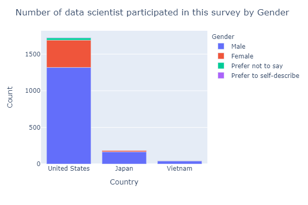
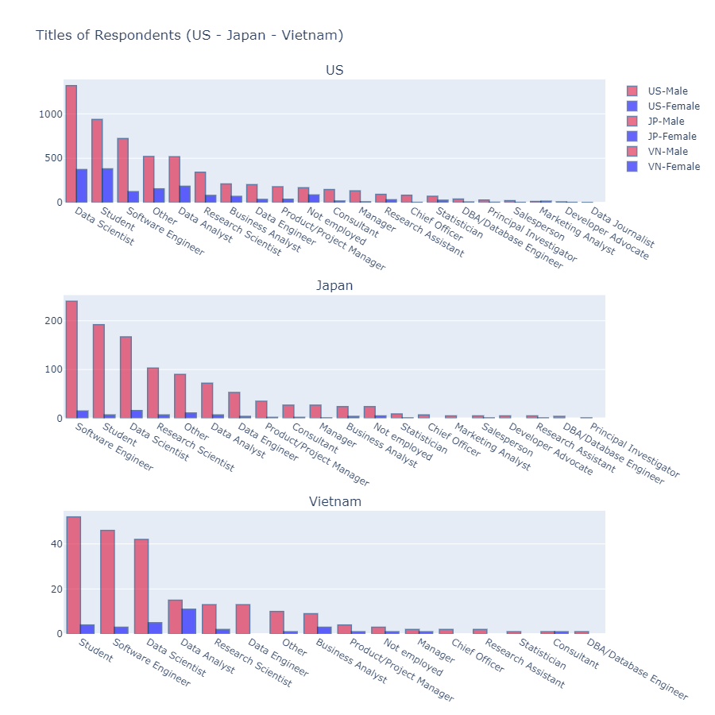
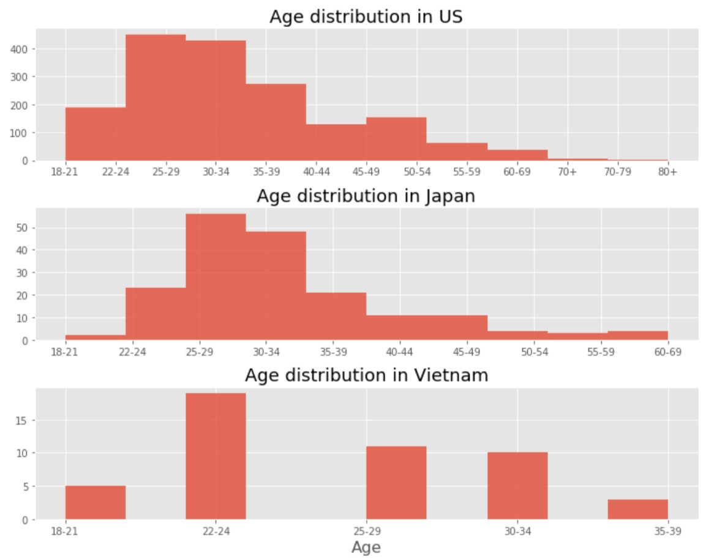
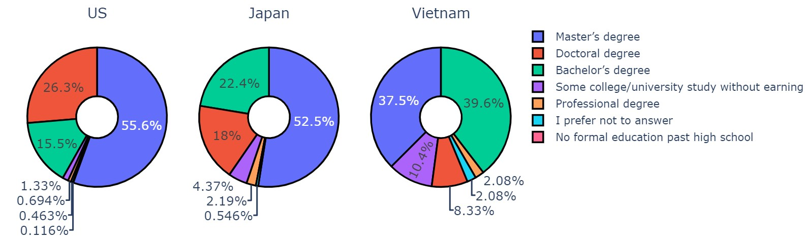
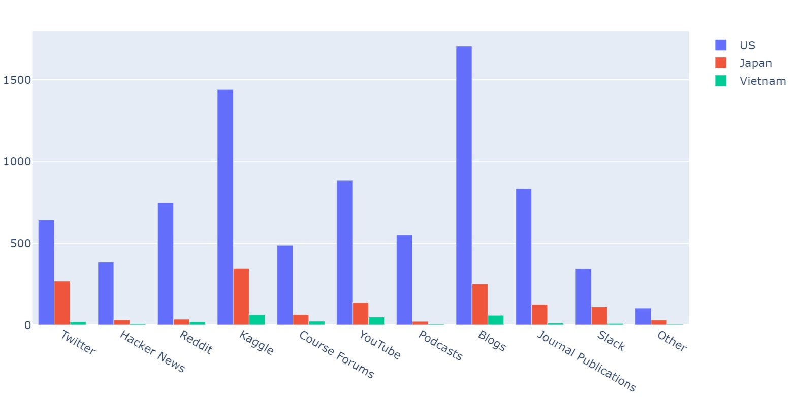

# Data Science in US, Japan and Vietnam

In this project, **a situation of data science in three countries: United States, Japan and Vietnam** was analyzed. Data was collected from [2018](https://www.kaggle.com/kaggle/kaggle-survey-2018) and [2019](https://www.kaggle.com/c/kaggle-survey-2019) Kaggle ML & DS Survery. Kaggle's State of ML and DS survey is the most comprehensive dataset available on the state of machine learning and data science today. Therefore, the deep analysis of this data was carried out.

**This project aims to getting a better understanding of the current state in Data Science filed by the comparison of various kind of information of data scientists in US, Japan and Vietnam.**

The structure of the project is divided into two main parts.

[**Part I: General view of all participants in 2018 and 2019**](#p1)

- [1.1. Distribution by country](#1.1)
- [1.2. Title and number of participants](#1.2)
- [1.3. Distribution of participants by age and gender](#1.3)
- [1.4. Top 10 countries in the world which have the highest number of DS](#1.4)
    
 
[**Part II: Focusing on 3 countries: US, Japan and Vietnam**](#p2)

- [2.1. Distribution of participants in these countries by job titles](#2.1)
- [2.2. Focusing on data scientist](#2.2)
    - [2.2.1 Number of data scientists](#2.2.1)
    - [2.2.2 Age distribution of data scientists](#2.2.2)
    - [2.2.3 Education distribution](#2.2.3)
    - [2.2.4 Salary analysis](#2.2.4)
- [2.3 Learning platforms for data scientists in these three countries](#2.3)
- [2.4 Most used language for data scientists](#2.4)

# Key Results 

In total, 9343 participants who come from US, Japan and Vietnam were analyzed. The results obtained from the analysis were summarized as followed.

(1) A number and proportion of data scientist to other career title in Japan and Vietnam are much lower than those of US. The field of data science is gradually proving its importance with many practical applications with the focus of Machine Leaning and Deep Learning. The low number and proportion of data scientist show a potential demand for this career in these two countries.

Fig. 1. Number of data scientists in US, Japan and Vietnam

Fig. 2. Number of respondents by career distribution

(2) The age of data scientists in all three countries are relatively young. However, US shows the dominant of the number of experienced data scientist with wider age range of respondents.

Fig. 3. Age distribution of data scientists

(3) The education of data scientist in US is considerably high with more than 80% of respondents having master and doctoral degree. These number drop considerably to about 70% and 45% in Japan and Vietnam, respectively.

Fig. 4. Education distribution of data scientists

(4) The average salary for data scientist in US is very high (~100k USD), and ranks in a second place. Japan has lower salary for data scientist and it is relatively same to other IT careers. The salary of data scientist in Vietnam is generally high, and highly depends on the ability of the candidate.

(5) The most popular platform to learn data science is Blog and Kaggle. In Japan and Vietnam, due to the language barrier, many people prefer more practical approach using Kaggle than reading a blog.

Fig. 5. Learning platforms
